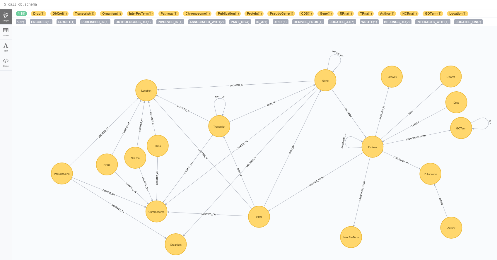

# tb2neo

[](https://travis-ci.org/COMBAT-TB/gff2neo) [](https://coveralls.io/github/COMBAT-TB/gff2neo?branch=master)

Builds a graph database from GFF files.

## Up and running

### Docker

```
$ docker-compose up -d
```
and `docker-compose -f logs` for the logs.

Point your browser to [localhost:7474](http://0.0.0.0:7474) and run `call db.schema()`.

### Standalone

**Pull and run the [neo4j docker image](https://hub.docker.com/_/neo4j/):**

```
$ docker run -d -p 7474:7474 -p 7687:7687 --name neo -e NEO4J_AUTH=none -v=$HOME/neo4j/data:/data neo4j:3.2.8
```

**Create a virtual environment:**

```
$ virtualenv envname
$ source envname/bin/activate
$ pip install -r requirements.txt
$ pip install -e .
$ tb2neo --help
$ tb2neo load_gff --gff_files data/gff_files
```

Point your browser to [localhost:7474](http://localhost:7474]) and run `call db.schema()`.

### `db.schema()`



