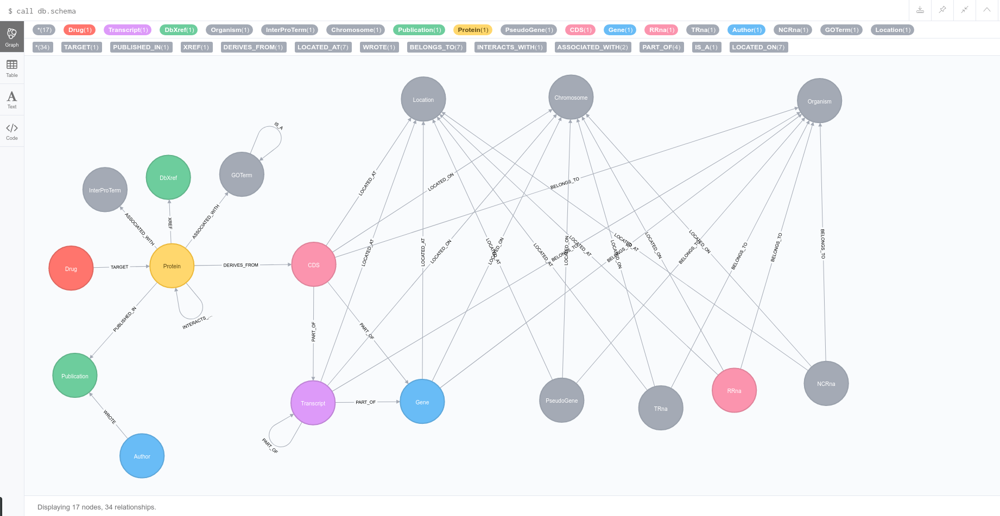

# gff2neo
Build an [H37rv](https://en.wikipedia.org/wiki/H37Rv) graph database from a [GFF file from EnsemblBacteria](ftp://ftp.ensemblgenomes.org/pub/bacteria/release-30/gff3/bacteria_0_collection/mycobacterium_tuberculosis_h37rv).


## Up and running

### Docker

```
$ docker-compose up -d
```
and `docker-compose -f logs` for the logs.

Point your browser to [localhost:7474](http://0.0.0.0:7474) and run `call db.schema()`.

### Standalone

**Pull and run the [neo4j docker image](https://hub.docker.com/_/neo4j/):**

```
$ docker run -d -p 7474:7474 -p 7687:7687 --name neo -e NEO4J_AUTH=none -v=$HOME/neo4j/data:/data neo4j:3.2.2
```

**Create a virtual environment:**

```
$ virtualenv envname
$ source envname/bin/activate
$ pip install -r requirements.txt
$ pip install --editable .
$ gff2neo --help
$ gff2neo load_gff
```

Point your browser to [localhost:7474](http://localhost:7474]) and run `call db.schema()`.

### `db.schema()`



