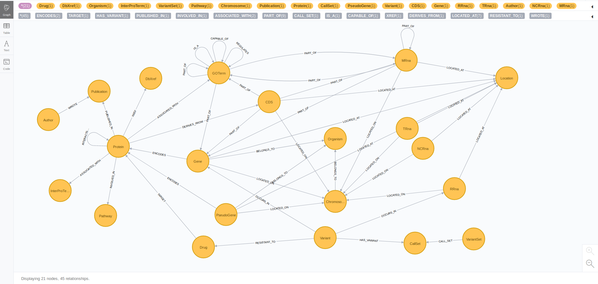

# tb2neo

[](https://travis-ci.org/COMBAT-TB/tb2neo) [](https://coveralls.io/github/COMBAT-TB/tb2neo?branch=master)

Parses _M.tuberculosis_ annotation (GFF file) and builds a Neo4j graph
database storing the annotated features. _tb2neo_ also aggregates and maps
these annotated features to external services such as UniProt, CheMBL,
DrugBank, KEGG, Reactome, QuickGo, STRING-DB etc.

## Usage

### Neo4j Installation

- Instructions for a standalone Neo4j installation can be found [here](https://neo4j.com/docs/operations-manual/current/installation/).

- Using [Docker](https://docs.docker.com/):

    ```sh
    $ docker run -d -p 7474:7474 -p 7687:7687 --name neo -e NEO4J_AUTH=none -v=$HOME/neo4j/data:/data neo4j:3.5
    ...
    ```

### `tb2neo` Installation

- Using `pip`:

    ```sh
    $ pip install -i https://test.pypi.org/simple/ tb2neo
    ...
    ```

- Using `setup`:

    Clone repository and create a virtual environment:

    ```sh
    $ git clone https://github.com/COMBAT-TB/tb2neo.git
    ...
    $ cd tb2neo
    $ virtualenv envname
    $ source envname/bin/activate
    $ pip install -r requirements.txt
    $ python setup.py install
    ```

### Loading TB Data

To load TB data, we use the H37Rv GFF3 file from [EnsemblBacteria](https://bacteria.ensembl.org/Mycobacterium_tuberculosis_h37rv/Info/Index/).

Run the following command to see available options

```sh
$ tb2neo --help
...
```

Run the following command to load GFF features to Neo4j

```sh
$ tb2neo load_gff --gff_files PATH/TO/TB_GFF3_FILES
...
```

### Exploring TB data

Point your browser to [localhost:7474](http://localhost:7474]).

```cql
db.schema()
```


